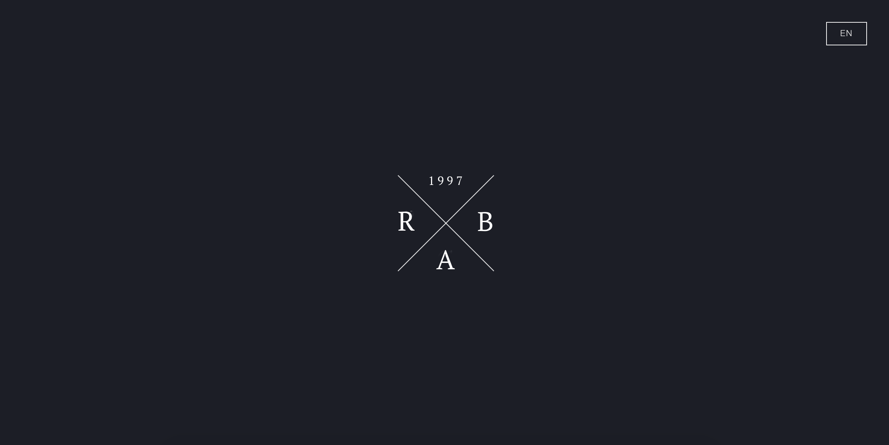

  

# v1

First iteration of my personal website built with HTML, CSS and Javascript.

> 📢 **PSA for those who want to fork or copy this repo and use it for their own site:**
>
> Please be a decent person and send me a message! I'd just like to know if you're using it. Refer to this handy [quora post](https://www.quora.com/Is-it-bad-to-copy-other-peoples-code) if you're not sure.
